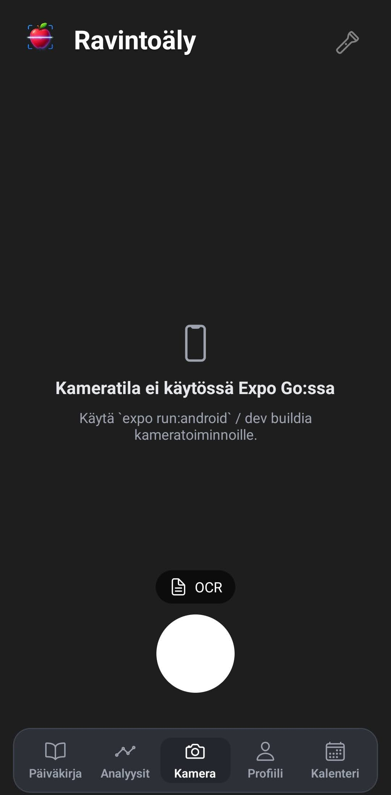
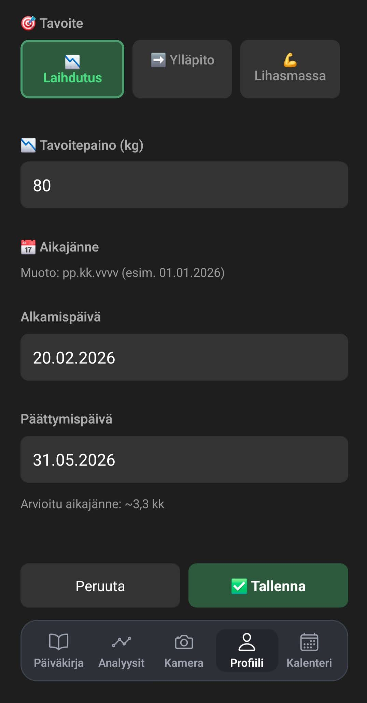
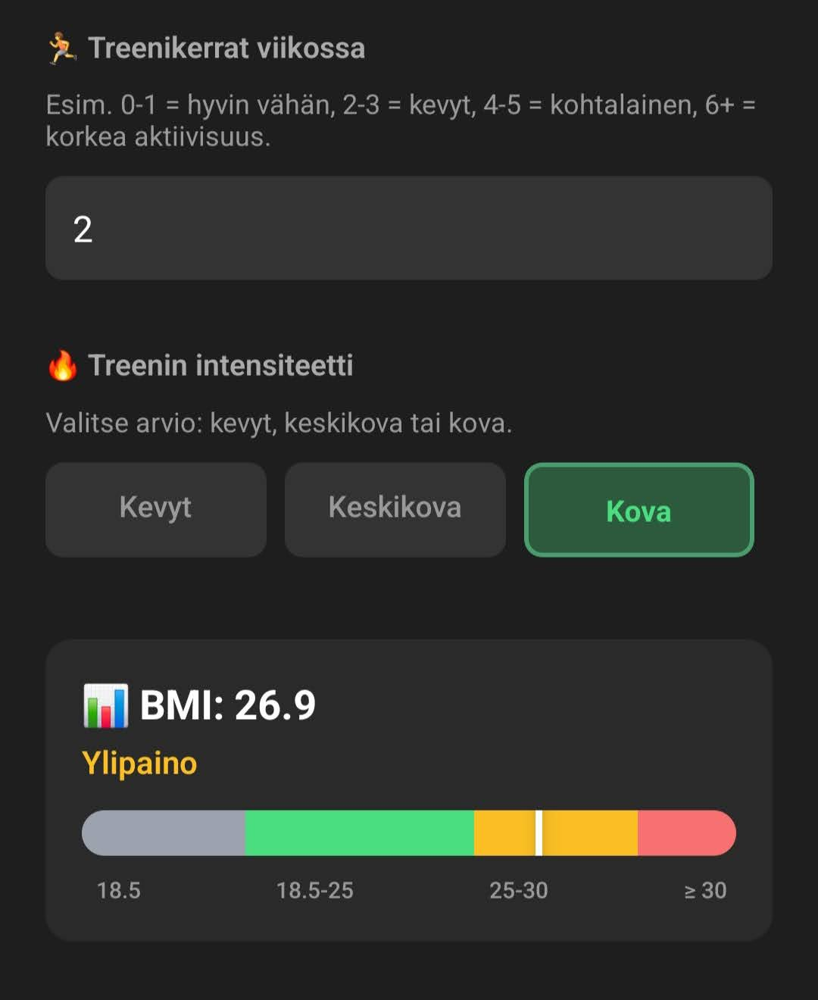
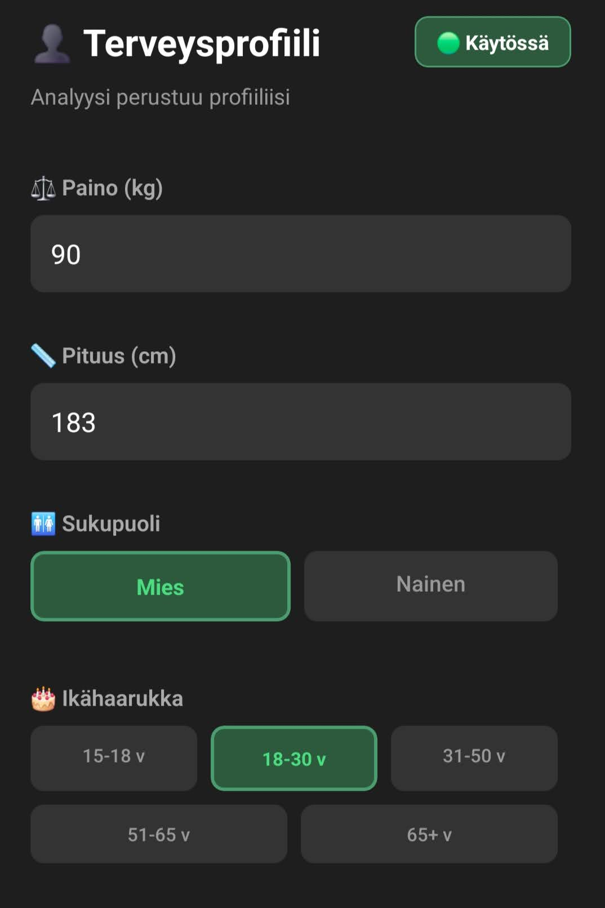
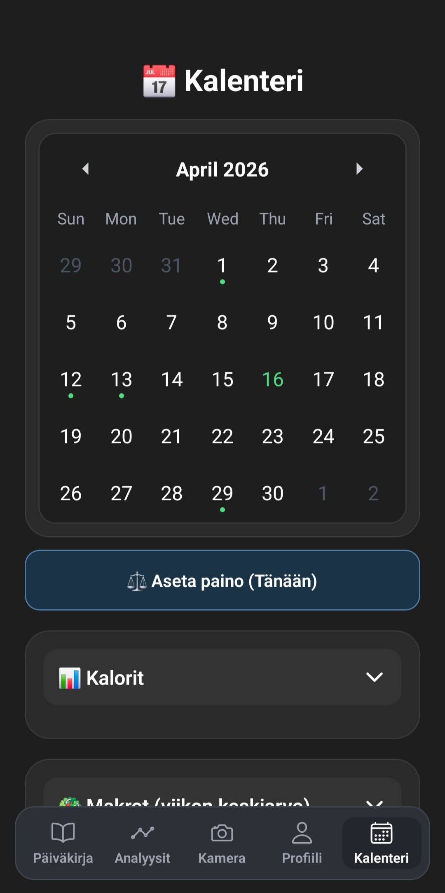
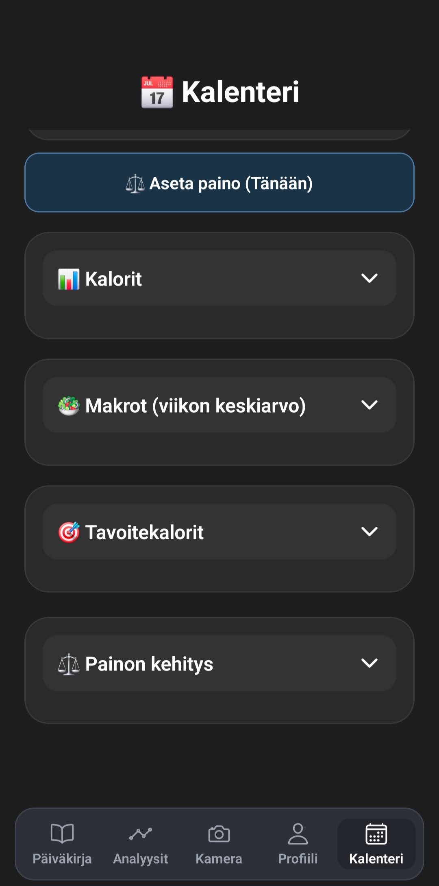
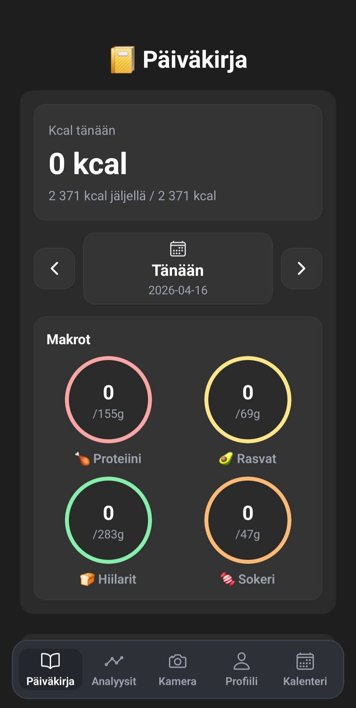
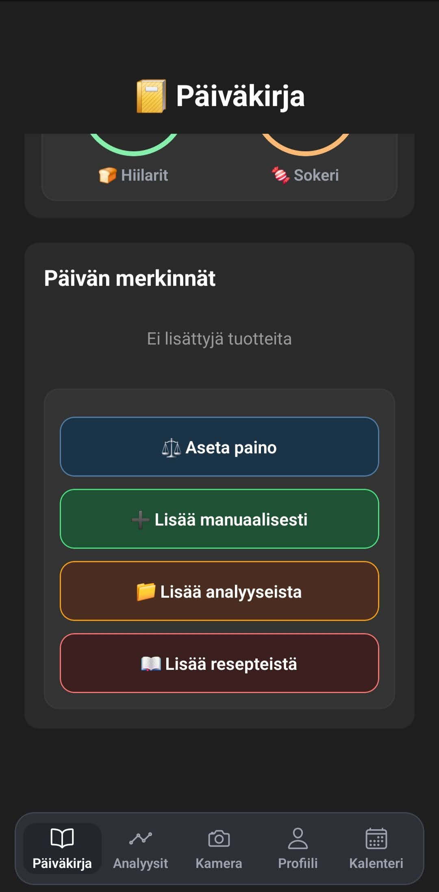
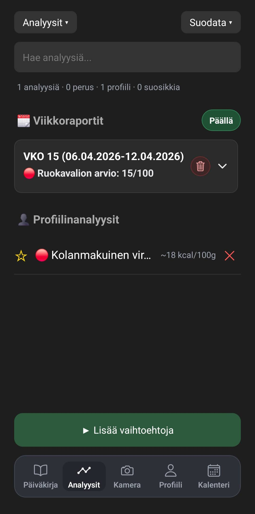

# Ravintoaly (Food Scan App)

Ravintoaly on Expo/React Native -sovellus, jolla voit skannata tuotteita, analysoida ravintoarvoja ja seurata paivittaista etenemista.

## Ominaisuudet

- OCR-skannaus kameralla (Google Vision API)
- AI-pohjainen analyysi backendin kautta
- Paivakirja kaloreille ja makroille
- Terveysprofiili (paino, pituus, tavoite, BMI)
- Kalenteri paivittaiselle seurannalle
- Viikkoraportit ja analyysien suodatus

## Teknologiat

- Expo + React Native
- TypeScript
- Expo Router
- React Native Vision Camera

## Kaynnistys lokaalisti

1. Asenna riippuvuudet:

```bash
npm install
```

2. Luo oma ymparistotiedosto:

```bash
copy .env.example .env
```

3. Tayta `.env`:

```env
EXPO_PUBLIC_BACKEND_URL=https://foodscanbackend.food
EXPO_PUBLIC_GOOGLE_VISION_API_KEY=your_google_vision_api_key_here
```

4. Kaynnista sovellus:

```bash
npx expo start
```

Huom: Kameraominaisuudet vaativat dev buildin (eivat toimi taydellisesti Expo Go:ssa).

## Kuvakaappaukset


*Kamera-nakyma OCR-skannaukseen. Jos kaytat Expo Go:ta, sovellus ohjaa dev buildin kayttoon kameraa varten.*


*Tavoitteen asetus: valittu tavoite, tavoitepaino ja aikajanne.*


*Treeniaktiivisuus, intensiteetti ja BMI-visualisointi samassa nakymassa.*


*Terveysprofiilin perustiedot: paino, pituus, sukupuoli ja ikahaarukka.*


*Kalenterin kuukausinakyma paivakohtaiseen seurantaan.*


*Kalenterin yhteenvetokortit: kalorit, makrot, tavoitekalorit ja painon kehitys.*


*Paivakirjan paivanakyma: kalorit ja makrojen seuranta.*


*Nopeat toiminnot paivan merkintoihin: paino, manuaalinen lisays, analyysit ja reseptit.*


*Analyysit-vaihtilehti: viikkoraportit, haku, suodatus ja profiilianalyysit.*

## Turvallisuus

- Aitoja avaimia ei tallenneta git-repoon.
- `.env` on ignoroitu gitissa.
- Julkiseen repoon kuuluu vain `.env.example`.

## Lisadokumentaatio

- [GitHub + API-ohjeet](GITHUB_OHJEET.md)
- [Backend-ohje annosvarmennukseen](BACKEND_AI_KUVA_VARMISTETAAN_ANNOS_OHJE.md)
